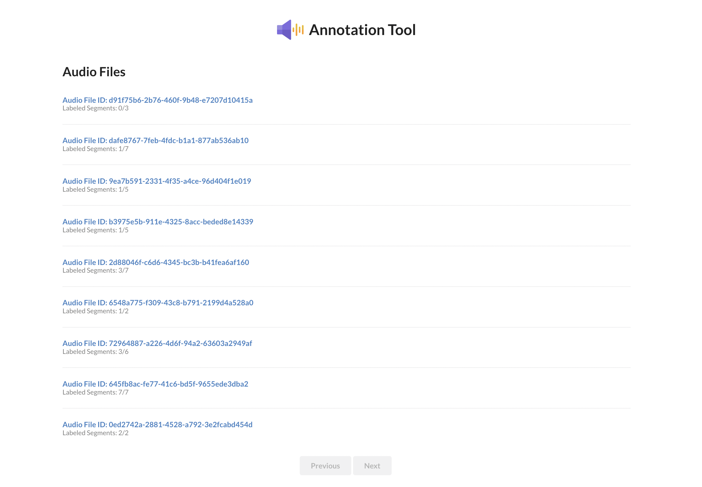
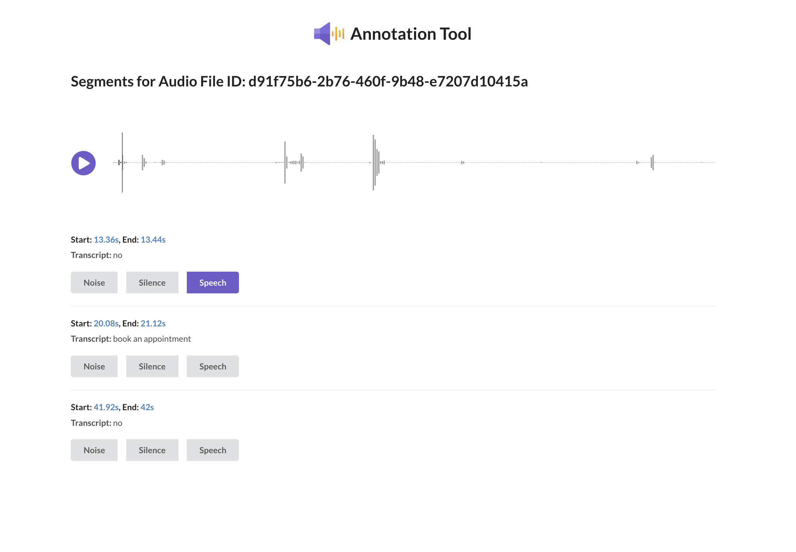

# Audio Annotation Tool

## Using the app

Run `docker-compose up` from the root of the repository. This will take a few minutes to install dependencies.

Navigate to `localhost:3000` to view the app.

Click on any of the files to open the detail view.

Play the audio by clicking the play button. Each segment has clickable timestamps. Annotate the segment using the buttons.

Annotating more segments will move the audio file down the list on the index view. This is done so that high priority audio files --
those with the least annotations -- have more visibility.

## System design

- The backend API runs on port 5000 using Python's FastAPI. You can view the docs at `localhost:5000/docs`. The relevant api declarations are in `app/main.py`
- Audio files are stored in MinIO, an S3 compatible object store. You can manually upload files at `localhost:9000`
- Data is stored in PostgreSQL
- The frontend is written in React defined within the `frontend` directory.
- The various services are decoupled and depend on each other using healthchecks.

## Assumptions

- I have assumed that audio files will be relatively short since they are loaded into the browser's memory using the audio API rather than being streamed. Streaming would've added another layer of complexity. Likewise, segments are assumed to not be too many and have therefore not been paginated in the API.
- I assumed it was okay to hardcode endpoint addresses and passwords to services instead of using a secrets manager since this is not a production level application. In the same spirit, I have not used any code formatting, linting, or unit testing -- instead doing my best to write as clear code as possible.
- I'm assuming the ports used for services are free on your computer! If you happen to be running processes on these ports either shut them down temporarily or modify the ports within this repo.